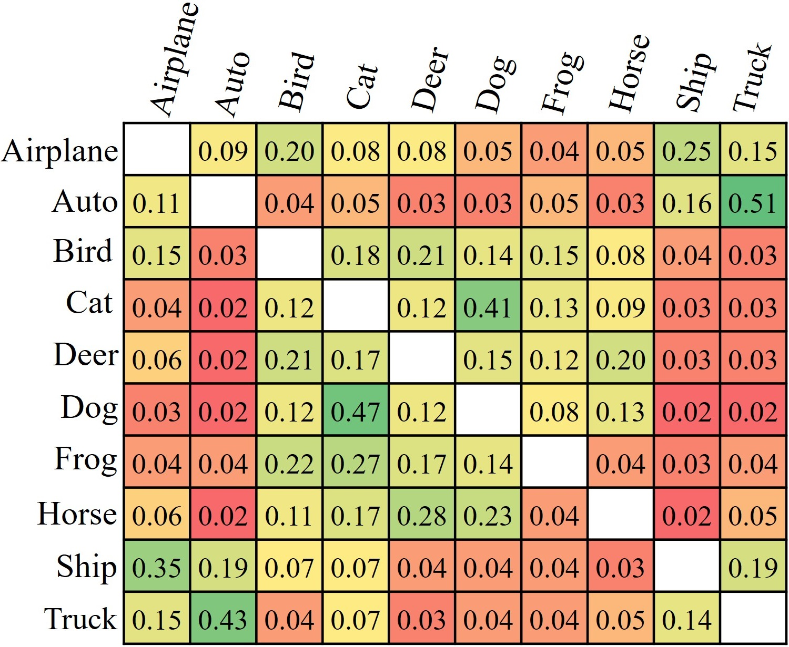
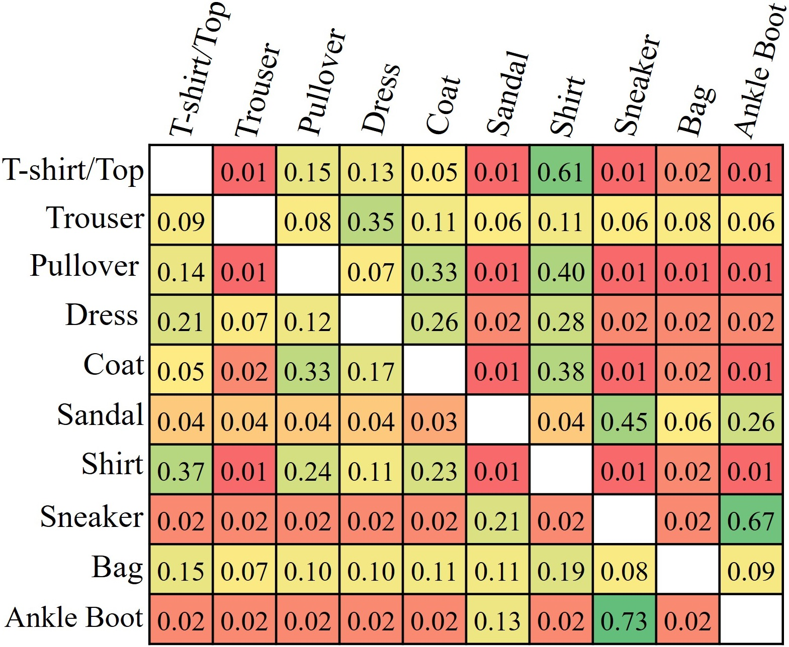
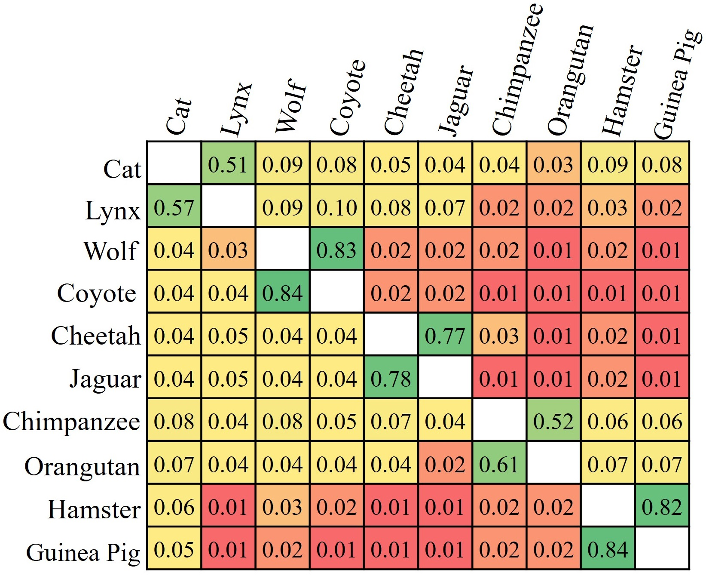

# Label Smoothing++ or LS++
Official Implementation of paper [Label Smoothing++: Enhanced Label Regularization for Training Neural Networks](https://bmvc2024.org/proceedings/392/). <br>

## Table of Contents
- [Introduction](#introduction)
  - [Overview](#overview)
  - [Algorithm](#algorithm)
- [Usage](#usage)
  - [Requirements](#requirements)
  - [Run Commands](#run-commands)
  - [Data](#data)
- [Results](#results)
  - [Learned C-Matrices](#learned-c-matrices)
- [Using Label Smoothing++ with new tasks](#using-label-smoothing-with-new-tasks)
- [Cite](#cite)

## Introduction
### Overview
- Label smoothing++ is a label regularization technique that learns optimal training targets.
- Training targets are learned using a C-Matrix.
 	- In a classification task with **𝐾** classes, each class learns a **K−1** dimensional probability vector for non-target classes
	- These probability vectors are **combined to form the C-Matrix (K x K)** by setting the target class (itself) probability to 0 on the diagonal.
- Probability vectors from the C-matrix are combined with a one-hot vector to create the final training target.
	- The target class probability is fixed but the non-target class probabilities are flexible.
- Key benefits:
    - Encourages more flexible learning.
    - Improves network robustness and accuracy.

</img>

### Algorithm
1. **Initialize the C-Matrix** with different learnable probability vectors for each class.
2. For each sample, create its **1-hot vector** of the target class.
3. Use the **C-Matrix** to fetch the corresponding **probability vector** for non-target classes.
4. **Combine** the 1-hot vector and the C-Matrix vector using a **weighted sum** controlled by a **hyperparameter** α.
5. Optimize the network parameters with **cross-entropy loss**.
6. Train the C-Matrix with the **reverse cross-entropy loss**.
7. Repeat steps 2–6 until convergence.

These steps are showcased in the above figure and for the PyTorch code of Label Smoothing++ loss refer to <a href="lspp.py">lspp.py</a>.

## Usage
### Requirements
Python, scikit-learn, PyTorch, and torchvision
 
### Run command:
To train a model using Label Smoothing++ (LS++), use **lspp** as the **method** argument. For instance, to train AlexNet on CIFAR10:
```
python main.py --dataset cifar10 --model alexnet --method lspp
```

The `--apply_wd` argument controls whether weight decay should be applied to the C-Matrix (Default: True). Setting this to `False` provides a sharper C-Matrix but may reduce performance.

### Data
- To change the dataset, **replace CIFAR10** with the appropriate dataset. <br>
- **CIFAR10**, **CIFAR100**, **FashionMNIST**, and **SVHN** are automatically downloaded by the script.
- **TinyImageNet**, **Animals10n**, and **Imagenet100** need to be downloaded manually (links below).
	- [TinyImageNet](http://cs231n.stanford.edu/tiny-imagenet-200.zip)  
	- [Animals10N](https://dm.kaist.ac.kr/datasets/animal-10n/)  
	- [ImageNet100](https://www.kaggle.com/datasets/ambityga/imagenet100)  
- For manually downloaded datasets, use the `--data_path` argument to specify the path to the dataset. Example:
```bash
python main.py --method lspp --model resnet18 --dataset tinyimagenet --data_path /path/to/data
```

## Results
### Qualitative Results

### Learned C-Matrices

| CIFAR10  | FashionMNIST    | Animals-10N    |
|-------------|-------------|-------------|
| </img> | </img> | </img>|

- Showcases that each class favors non-target classes similar to the target class for probability assignment.
- E.g. In the **CIFAR10** dataset, while assigning the probabilities for class **Dog**.
	- The network favors the **Cat** class, followed by **Horse**, **Deer**, etc because of their similarities.
 	- The last preference is for the non-animal classes like **Ship**, and **Truck**.
  	- Other classes and the datasets show the same trend.
- The learned C-Matrix for the CIFAR100 dataset is available <a href="./figures/c_cifar100.jpg">here.</a> 

## Using Label Smoothing++ with new tasks
PyTorch code for quick integration with new frameworks:
```
from lspp import LSPP

# Define loss function
loss_fn = LSPP(num_classes, alpha=0.1).cuda()

# Add C-Matrix to the training parameters of the optimizer
opt = SGD(list(model.parameters()) + list(loss_fn.parameters()), lr, mom, wd)
.
.
# Calculate loss and gradient update (no change)
loss = loss_fn(logits, targets)
opt.zero_grad()
loss.backward()
opt.step()
```

## Cite
If you found our work/code helpful, please cite our paper:
```
@inproceedings{Chhabra_2024_BMVC,
author    = {Sachin Chhabra and Hemanth Venkateswara and Baoxin Li},
title     = {Label Smoothing++: Enhanced Label Regularization for Training Neural Networks},
booktitle = {35th British Machine Vision Conference 2024, {BMVC} 2024, Glasgow, UK, November 25-28, 2024},
publisher = {BMVA},
year      = {2024},
url       = {https://papers.bmvc2024.org/0392.pdf}
}
```
